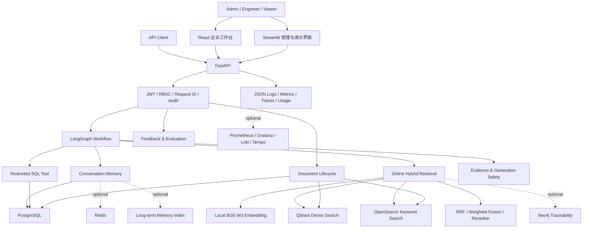
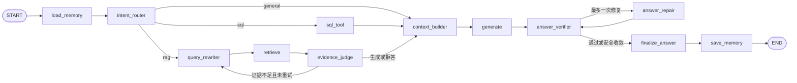
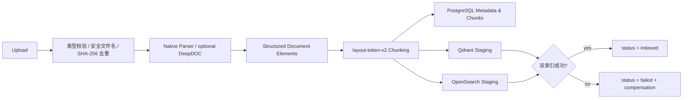

# Industrial Quality Agentic RAG Assistant

面向制造业质量场景的企业级 Agentic RAG 助手。系统将分散在质量标准、SOP、PFMEA、设备手册、历史问题报告和结构化业务表中的知识统一接入，通过可控的 LangGraph 工作流完成检索、分析、证据判断、答案生成、引用校验和审计追踪。

> 本项目是工业 AI 工程参考实现，适合技术验证、作品展示和架构学习。仓库中的演示数据、规则及模型输出不能替代正式工艺文件、质量工程师判断或生产审批。

## 为什么需要这个项目

制造现场的质量问题通常不是“问一个模型”就能解决。真正困难的是知识分散、版本复杂、术语精确、权限敏感，并且每个结论都需要能够回到原始证据。

典型问题包括：

- 质量标准、作业指导书、PFMEA、Lesson Learned 和设备手册分散在不同系统中，检索成本高；
- 故障代码、车型、零件号、工位名称等工业关键词要求精确匹配，单纯向量检索容易漏召回；
- 质量趋势和报警统计来自 PostgreSQL 等结构化数据，不能只依赖文档问答；
- 同一问题可能涉及现象、原因、控制要求、临时措施和永久措施，需要跨文档组织证据；
- 大模型可能在证据不足时补全细节，工业场景必须支持拒答、引用和答案修复；
- 文档上传、删除、重建索引、SQL 分析和用户管理必须受到权限控制并留下审计记录。

本项目的目标不是构造一个万能聊天机器人，而是建立一条可管理、可追溯、可评估的工业知识服务链路。

## 业务场景

| 使用角色 | 典型任务 | 系统处理方式 |
|---|---|---|
| 现场人员 | 查询缺陷现象、设备报警和处置步骤 | Hybrid Retrieval 检索相关标准与案例，返回带引用的回答 |
| 质量工程师 | 联合查看 PFMEA、SOP、检验要求和 Lesson Learned | 查询特征识别追溯需求，聚合多类文档证据 |
| 工艺/设备工程师 | 查询参数要求、故障代码和维护说明 | 语义召回与工业关键词召回融合，保留页码和来源 |
| 管理人员 | 查询检测数量、报警分布和质量趋势 | 进入受限 SQL 分支，对白名单业务表执行只读分析 |
| 知识库管理员 | 上传、删除、重建和查看文档状态 | 管理文档生命周期并维护 PostgreSQL、Qdrant、OpenSearch 一致性 |
| 平台运维人员 | 定位慢请求、降级、模型用量和失败节点 | 使用 request_id 串联日志、指标、Trace、用量与审计记录 |

## 设计目标

- **可信回答**：先判断证据，再生成答案；引用不合法或支持度不足时修复或拒答。
- **混合检索**：结合向量语义、关键词精确匹配、融合排序和可选重排。
- **业务分流**：区分文档知识问答、结构化 SQL 分析和普通对话。
- **知识可治理**：文档拥有唯一 `doc_id`、版本、状态、Chunk 和双索引生命周期。
- **接口可兼容**：稳定保留 `/api/v1/graph-chat` 及其核心请求、响应字段。
- **权限可审计**：JWT、RBAC、操作审计和结构化日志覆盖高风险操作。
- **能力可降级**：OpenSearch、Reranker、Redis、Neo4j 等组件失败时按配置降级。
- **效果可评估**：分别评估路由、检索、生成可信度、反馈和端到端延迟。

## 总体架构



## 在线请求链路

主工作流以 [`app/graph/workflow.py`](app/graph/workflow.py) 和 [`app/graph/state.py`](app/graph/state.py) 为准。



### 1. 会话记忆与意图路由

`load_memory` 根据 `session_id` 加载历史消息，随后 `intent_router` 将请求归入：

- `rag`：质量标准、故障诊断、历史问题、规则和案例等知识型问题；
- `sql`：检测记录、报警统计、趋势分析等结构化数据问题；
- `general`：不需要知识库或 SQL 的普通交互。

诊断、规则和案例不再作为一级路由。它们通过 `query_features` 表达文档类型偏好、追溯需求和缺失证据维度，再进入统一 RAG 检索链路。Legacy Rule/Case 文件仍保留用于兼容和独立测试，但没有注册到当前主工作流。

### 2. 查询改写与 Hybrid Retrieval

RAG 请求先结合历史上下文改写为可独立检索的问题，再进入在线混合检索：

1. 本地 BGE-M3 生成查询向量；
2. Qdrant 进行 Dense Vector Search；
3. OpenSearch 进行关键词检索；
4. RRF 或加权分数融合两路结果；
5. 按配置使用 CrossEncoder Reranker；
6. 需要问题追溯时，补充文档类型语义和可选 Neo4j 关系证据；
7. OpenSearch 或 Reranker 异常时记录降级原因，并按配置回退到可用链路。

检索结果保留 `doc_id`、`chunk_id`、来源、版本、页码、模态和各阶段分数，供引用、评估和问题定位使用。

### 3. Evidence Judge

Evidence Judge 不直接生成答案，而是综合以下信号判断证据是否足够：

- 各检索后端分数及融合分数；
- 查询词覆盖情况；
- 独立证据数量；
- 关键证据维度是否缺失；
- 当前请求是否处于降级模式。

第一次证据不足时，工作流携带缺失维度重新改写并检索；重试后仍不足时进入确定性拒答路径，避免让模型凭空补全事实。

### 4. Context Builder 与答案生成

Context Builder 在不修改原始 `contexts` 和 `citations` 的前提下：

- 对证据去重；
- 分配稳定的 `资料1`、`资料2` 等引用标签；
- 控制条数和字符预算；
- 优先保留包含参数、数值、结论和操作要求的语义片段。

Answer Generator 只使用整理后的证据生成草稿。Prompt 通过文件化 Catalog 和 Release Manifest 管理，生产请求可记录 Prompt ID、版本、Hash 和 Release。

### 5. 引用校验、语义验证与答案修复

生成后的草稿必须经过可信度链路：

- **Citation Validator**：检查引用编号是否存在、事实性声明是否带引用、引用覆盖率是否达到阈值；
- **Semantic Citation Validator**：按配置检查声明是否真正被引用证据支持；
- **Answer Repair**：校验失败时最多调用一次修复流程，只允许删除无依据内容、修正引用或弱化表达；
- **Finalize Answer**：修复后仍失败时裁剪到安全声明或拒答；
- **Save Memory**：只保存最终答案，不把未经验证的草稿写入会话历史。

确定性引用校验不等同于自然语言蕴含证明。语义验证依赖配置的模型服务，默认采用 fail-open 降级策略并明确记录降级状态。

## 离线知识库生命周期

企业文档主入口位于 [`app/services/document_service.py`](app/services/document_service.py)。



当前实现支持 `.md`、`.txt`、`.pdf`、`.docx`、`.pptx`。解析结果先转换为统一文档元素，再使用 `layout-token-v2` 按标题、段落、页码和表格边界切分。Qdrant 与 OpenSearch 使用相同的 `doc_id/chunk_id`，通过 staging、promotion 和失败补偿维护双索引一致性。

`data/processed/chunks.json` 和 `scripts/ingest_docs.py` 属于 Legacy Demo 链路。后者可能重建旧 Collection，不应作为企业在线入库入口，也不应在包含需保留数据的环境中随意运行。

## 安全与权限

系统使用 JWT Bearer Token、PBKDF2-SHA256 密码哈希和服务端 RBAC。前端菜单隐藏只是交互优化，最终权限始终由 FastAPI 依赖校验。

| 能力 | admin | engineer | viewer |
|---|:---:|:---:|:---:|
| 文档问答 | ✓ | ✓ | ✓ |
| SQL 分析 | ✓ | ✓ | — |
| 查看文档 | ✓ | ✓ | ✓ |
| 上传文档 | ✓ | ✓ | — |
| 删除或重建文档 | ✓ | — | — |
| 提交答案反馈 | ✓ | ✓ | ✓ |
| 查看反馈与运行评估 | ✓ | ✓ | — |
| 用户管理与审计日志 | ✓ | — | — |

高风险操作会关联用户、角色、`request_id`、资源 ID、结果和错误信息写入审计记录。SQL Tool 只允许只读查询，并执行角色检查、表白名单、语句类型限制和结果行数限制。

## 数据存储职责

| 存储 | 主要职责 | 是否默认主链路 |
|---|---|---|
| PostgreSQL | 用户、审计、会话、文档、Chunk、反馈、评估、用量和业务样例表 | 是 |
| Qdrant | 文档向量索引；可选多模态和长期记忆独立 Collection | 是 |
| OpenSearch | 在线关键词索引及可选长期记忆关键词召回 | 是，可配置降级 |
| Redis | 短期记忆窗口和摘要缓存 | 否，分层记忆开启后使用 |
| Neo4j | 文档、Chunk 与质量实体的追溯关系 | 否，知识图谱开启后使用 |
| 本地文件 | 上传原件、解析资产、模型文件、评估集和运行报告 | 运行期资产，不应整体提交 Git |

## API 概览

| API | 说明 |
|---|---|
| `POST /api/v1/auth/login` | 登录并获取 JWT |
| `POST /api/v1/graph-chat` | LangGraph 同步问答主接口 |
| `POST /api/v1/graph-chat/stream` | SSE 流式回答与节点事件 |
| `GET/POST /api/v1/documents/*` | 文档列表、上传、详情、删除和重建 |
| `POST /api/v1/feedback` | 提交回答反馈 |
| `GET/POST /api/v1/evaluation/*` | 运行和查看评估 |
| `GET /api/v1/audit-logs` | 管理员查看审计记录 |
| `GET /api/v1/observability/*` | 用量、延迟和检索分析 |
| `GET /health/ready` | 依赖与可选组件 readiness |
| `GET /metrics` | Prometheus 指标 |

`/api/v1/graph-chat` 的主要请求字段：

```json
{
  "question": "某车型侧围焊点异常可能涉及哪些控制要求？",
  "top_k": 5,
  "session_id": "quality-demo-001",
  "retrieval_filters": {
    "doc_types": ["pfmea", "sop"]
  }
}
```

主要响应字段包括：

- `answer`、`citations`、`contexts`；
- `request_id`、`session_id`、`memory_messages`；
- `intent`、`rewritten_query`、`evidence_score`、`evidence_enough`、`retry_count`；
- `metadata` 中的检索模式、降级原因、节点耗时、Prompt 版本、Trace 和用量信息；
- 为兼容旧客户端保留的 `rule_result`、`sql_result`、`case_result`。

更多请求示例见 [docs/api_examples.md](docs/api_examples.md)。

## 技术栈

| 层次 | 技术实现 |
|---|---|
| 后端 API | Python 3.11、FastAPI、Pydantic、Uvicorn |
| Agent 编排 | LangGraph、LangChain |
| LLM | OpenAI-compatible Chat API，默认配置为 Qwen |
| 文本检索 | BGE-M3、Qdrant、OpenSearch、RRF/Weighted Fusion、CrossEncoder Reranker |
| 文档解析 | Native Structured Parser、可选 DeepDOC、可选 OCR/多模态适配 |
| 数据层 | PostgreSQL、Qdrant、OpenSearch、可选 Redis/Neo4j |
| 前端 | React 19、TypeScript、Vite、Ant Design；兼容 Streamlit 界面 |
| 可观测性 | JSON Log、request_id、OpenTelemetry、Prometheus、Grafana、Loki、Tempo |
| 测试与评估 | Python 脚本测试、Vitest、Playwright、检索指标、生成可信度指标、可选 RAGAS |
| 部署 | Docker、Docker Compose、Nginx |

## 实现状态与边界

项目明确区分“代码存在”“默认启用”“静态测试通过”和“真实环境验收通过”。

| 状态 | 能力 |
|---|---|
| 主链路实现 | FastAPI、JWT/RBAC、LangGraph、Qdrant + OpenSearch Hybrid Retrieval、Evidence Judge、Context Builder、生成、引用校验、单次修复、记忆保存 |
| 默认配置启用 | 本地文本 Embedding、OpenSearch 关键词检索、Reranker、拒答、引用校验、语义引用校验、答案修复、Telemetry/Metric/Usage |
| 可选且默认关闭 | 多模态检索、DeepDOC、分层记忆、Neo4j 知识图谱、RAGAS |
| 兼容实现 | Streamlit、Legacy Rule Tool、Legacy Case Tool、`chunks.json`/旧入库脚本 |
| 尚需真实环境验收 | 多模态图片问答质量、DeepDOC 大文档效果、Reranker 模型资源、RAGAS 真实 Judge、分层记忆和 Neo4j 的生产规模基准 |
| 尚未实现或未形成生产能力 | 多租户与文档 ACL、异步入库任务队列、对象存储、病毒扫描、完整 Prompt 审批/A-B 流程、制品签名与 SBOM |

测试通过不等于生产准确率。Evidence 阈值、引用覆盖率和检索指标仍需要基于企业自己的文档、问题和风险成本持续校准。

## 快速启动

### 前置条件

- Docker Desktop 或 Docker Engine + Compose v2；
- 可访问的 OpenAI-compatible LLM；
- 本地 BGE-M3 模型文件；
- 建议至少 8 GB 内存。

### 1. 创建本地配置

Windows PowerShell：

```powershell
Copy-Item .env.example .env
```

Linux/macOS：

```bash
cp .env.example .env
```

至少检查以下配置，不要使用示例密钥部署生产环境：

```dotenv
LLM_MODEL=qwen-plus
LLM_API_KEY=replace_me
LLM_BASE_URL=https://example.com/v1
JWT_SECRET_KEY=replace_with_a_long_random_secret
EMBEDDING_PROVIDER=local
LOCAL_EMBEDDING_MODEL_PATH=/app/data/models/bge-m3
```

### 2. 启动基础服务并准备模型

```powershell
docker compose up -d postgres qdrant opensearch
docker compose run --rm api python -m scripts.download_local_embedding_model --destination /app/data/models/bge-m3
```

仅在全新的演示环境初始化样例数据库：

```powershell
docker compose --profile tools run --rm init-sql
```

> `init-sql` 是 Demo 初始化流程。不要在包含真实数据或需保留数据的环境中执行。

### 3. 启动应用

```powershell
docker compose up -d --build api react-web streamlit
```

默认入口：

- React 企业工作台：<http://localhost:30080>
- Streamlit：<http://localhost:30000>
- FastAPI Swagger：<http://localhost:18000/docs>
- Readiness：<http://localhost:18000/health/ready>
- Qdrant Dashboard：<http://localhost:6333/dashboard>

模型下载、索引迁移、Alias 激活、生产环境变量和故障排查见 [docs/deployment.md](docs/deployment.md)。

## 测试与质量门禁

以下 Mock/静态测试不应调用真实收费 API：

```powershell
python -B -m scripts.test_intent
python -B -m scripts.test_evidence_judge
python -B -m scripts.test_context_builder
python -B -m scripts.test_answer_validation
python -B -m scripts.test_semantic_citation_validation
python -B -m scripts.test_generation_repair_policy
python -B -m scripts.test_traceability
python -B -m scripts.validate_prompts
```

前端检查：

```powershell
Set-Location frontend
npm install
npm run typecheck
npm test
npm run build
```

发布前快速检查：

```powershell
python -m scripts.release_check
docker compose config --quiet
```

需要 PostgreSQL、Qdrant、OpenSearch 或真实模型的测试应与 Mock 基线分开执行，并在报告中明确标记环境与数据版本。完整测试顺序见 [docs/codex_handoff.md](docs/codex_handoff.md)。

## 可观测性与质量闭环

每个 graph-chat 请求生成或接收一个 `request_id`，并贯穿 API、LangGraph State、节点日志、检索事件、模型用量、反馈和审计记录。响应 `metadata` 增量返回总耗时、检索模式、降级状态、Prompt Release 和 Trace ID 等信息。

可选观测栈：

```powershell
docker compose -f docker-compose.yml -f docker-compose.observability.yml up -d --build
```

- Grafana：<http://localhost:3000>
- Prometheus：<http://localhost:9090>
- API Metrics：<http://localhost:18000/metrics>

质量闭环由四类信号组成：

1. 用户正向、中性和负向反馈；
2. 路由、来源命中、答案关键词和记忆追问测试；
3. Precision@K、Recall@K、MRR、nDCG 和检索延迟；
4. 引用覆盖率、修复成功率、拒答率及可选 RAGAS 指标。

详细说明见 [docs/observability.md](docs/observability.md)、[docs/retrieval_evaluation.md](docs/retrieval_evaluation.md) 和 [docs/rag-troubleshooting.md](docs/rag-troubleshooting.md)。

## 项目结构

```text
.
├── app/
│   ├── api/                # Auth、Chat、Documents、Feedback、Evaluation
│   ├── core/               # Config、Security、Dependencies、Logging
│   ├── graph/              # LangGraph State、Workflow、Nodes
│   ├── generation/         # Citation、Semantic Validation、Abstention
│   ├── rag/                # Parsing、Chunking、Embedding、Retrieval、Generation
│   ├── traceability/       # 质量实体与问题追溯
│   ├── memory/             # PostgreSQL 与可选分层记忆
│   ├── knowledge_graph/    # 可选 Neo4j 关系证据
│   ├── observability/      # Model/Token/Cost Usage
│   ├── prompting/          # Prompt Catalog 与 Release Registry
│   ├── services/           # 文档、审计、反馈、评估等业务服务
│   └── schemas/            # API 数据契约
├── frontend/               # React 企业工作台
├── ui/                     # Streamlit 兼容界面
├── prompts/                # 版本化 Prompt 与 Release Manifest
├── scripts/                # 迁移、评估、测试和发布检查
├── data/                   # 规则、评估集及本地运行数据
├── docs/                   # 架构、部署、发布和排障文档
├── docker-compose.yml
└── docker-compose.observability.yml
```

## GitHub 上传与数据安全

- 不要提交 `.env`、Token、API Key、生产数据库地址或默认密码；
- `data/uploads/`、解析图片、模型文件、临时备份和运行报告应保留在 Git 之外；
- 上传工业文档前检查 VIN、零件号、内部主机、人员信息和生产标识；
- `.gitignore` 不能自动移除已经被 Git 跟踪或已经进入历史的文件；
- 公开仓库前应额外执行 Secret Scan 和 Git 历史检查。

## 文档导航

- [系统技术方案](docs/architecture.md)
- [部署指南](docs/deployment.md)
- [API 调用示例](docs/api_examples.md)
- [项目交接与验证边界](docs/codex_handoff.md)
- [文档解析与 Chunk 设计](docs/document-parsing-and-chunking.md)
- [检索评估方案](docs/retrieval_evaluation.md)
- [可观测性说明](docs/observability.md)
- [RAG 排障手册](docs/rag-troubleshooting.md)
- [发布与回滚指南](docs/release.md)
- [技术面试与代码走读](docs/project-technical-interview-guide.md)

## Roadmap

- 多租户、部门级数据隔离和文档 ACL；
- 异步文档入库、任务进度与失败重试；
- 对象存储、病毒扫描和文件生命周期管理；
- Prompt 审批、A/B 测试和运营界面；
- 依赖漏洞扫描、SBOM、镜像签名和制品可信发布；
- 多模态、DeepDOC、分层记忆和知识图谱的真实生产数据基准。

## License

[MIT](LICENSE)
