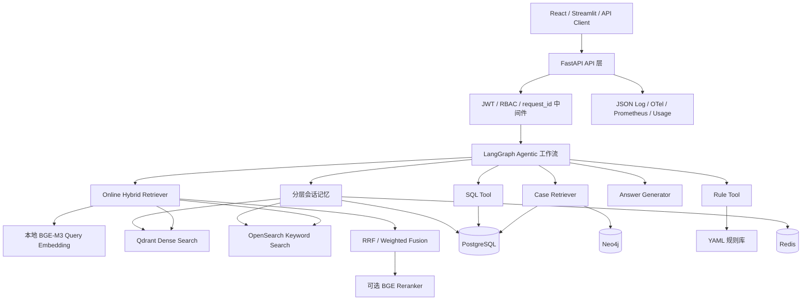
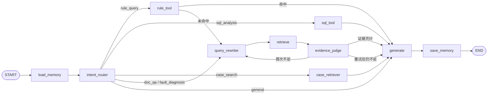
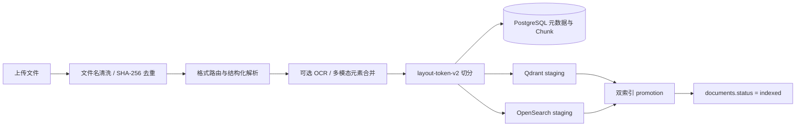
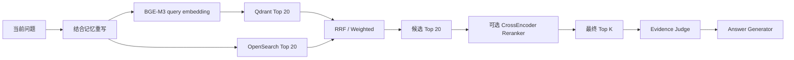
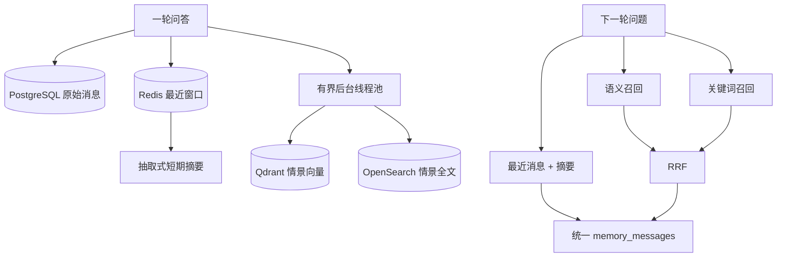

# 工业质量 Agentic RAG 系统技术方案

## 1. 文档定位

本文说明当前仓库已经实现的技术架构、LangGraph 节点逻辑、离线知识加工、在线混合检索、分层记忆、工具调用、生成与可观测性。所有文件路径均以仓库根目录为起点。

系统定位是工业质量知识辅助系统，不是生产线安全控制器。涉及停线、放行、质量判定等高风险动作时，仍需要人工复核。

## 2. 业务目标与设计原则

工业质量问题并不只有“查文档”一种类型。系统需要同时处理：

- 设备手册、SOP、FMEA 和检验标准问答；
- 视觉识别、OCR、扭矩等异常诊断；
- PR 配置和判定规则查询；
- PostgreSQL 检测记录与告警统计；
- 历史质量案例与知识图谱路径检索；
- 连续追问、多轮上下文和历史情景召回。

因此系统采用以下原则：

1. 用显式状态图组织分支、回退和有限重试，不把所有问题塞进一条固定 RAG 链。
2. 确定性数据优先使用 Rule、SQL、Case Tool，文档型问题才进入 Hybrid RAG。
3. 离线索引与在线查询分离，运行时不依赖 `chunks.json`。
4. 文档向量、查询向量分别调用同一个进程级本地 Embedding Provider。
5. Qdrant 与 OpenSearch 使用统一 `doc_id/chunk_id`，并通过 staging、promotion 和补偿清理维护一致性。
6. 所有回答保留引用、证据分数、降级状态、节点耗时和 request_id。
7. PostgreSQL 是会话和业务事实的最终持久化层；Redis、Qdrant、OpenSearch 记忆失败时允许降级。

## 3. 总体架构

主要入口与边界：

| 层次 | 职责 | 关键文件 |
|---|---|---|
| API | 鉴权、请求校验、同步/流式响应、审计 | `app/api/routes_chat.py`、`app/core/deps.py` |
| Graph | 状态、节点、条件边、重试闭环 | `app/graph/state.py`、`app/graph/workflow.py` |
| RAG | Embedding、双路检索、融合、重排 | `app/rag/online_hybrid_retriever.py` |
| Tool | 规则、SQL、历史案例、知识图谱 | `app/tools/`、`app/knowledge_graph/` |
| Knowledge | 上传、解析、切分、索引生命周期 | `app/services/document_service.py` |
| Memory | 最近消息、短期摘要、长期情景召回 | `app/memory/` |
| Generation | Prompt Registry、上下文组装、答案生成 | `app/rag/generator.py`、`app/prompting/` |
| Observability | request_id、节点耗时、Trace、Metric、Usage | `app/core/logger.py`、`app/core/telemetry.py` |

## 4. LangGraph 主工作流

### 4.1 状态定义

`app/graph/state.py` 中的 `IndustrialRAGState` 是节点间唯一的数据契约。核心字段包括：

- 请求：`question`、`request_id`、`session_id`、`user`、`top_k`；
- 上下文：`memory_messages`、`memory_metadata`、`retrieval_filters`、`multimodal_query`；
- 路由：`intent`、`rewritten_query`、`retry_count`；
- 证据：`contexts`、`citations`、`evidence_score`、`evidence_enough`；
- 工具：`rule_result`、`sql_result`、`case_result`；
- 输出：`answer`、`retrieval_metadata`、`knowledge_graph_metadata`。

设计亮点是节点只返回自己修改的字段，LangGraph 负责合并 State；request_id、session_id 和用户身份始终随状态传递，便于日志关联与节点级权限检查。

### 4.2 流程图

工作流定义位于 `app/graph/workflow.py`。所有业务分支最终都经过 `generate -> save_memory -> END`，保证响应结构和记忆写入逻辑一致。

### 4.3 节点功能说明

| 节点 | 主要逻辑 | 输入/输出 | 设计考虑 | 代码路径 |
|---|---|---|---|---|
| `load_memory` | 按 session_id 加载最近对话；启用分层记忆时同时召回 Redis 摘要和长期情景 | 输入 question/session/user；输出 memory_messages、memory_metadata | 记忆在路由和改写前加载，使“那优先查哪个”可补全指代；Redis/长期索引异常可降级 | `app/graph/nodes/load_memory_node.py` |
| `intent_router` | Prompt 分类为六类意图；LLM 失败时使用关键词规则兜底 | 输出 intent | LLM 提供表达泛化，规则保证外部模型异常时仍可路由；case 判断优先于 fault，避免“历史异常案例”误分类 | `app/graph/nodes/intent_router_node.py` |
| `rule_tool` | 在 YAML 中匹配 PR 规则或故障关键词 | 输出 rule_result、contexts、citations | 规则命中直接生成，未命中回退 RAG；确定性规则不交给模型猜测 | `app/graph/nodes/rule_tool_node.py`、`app/tools/rule_tool.py` |
| `sql_tool` | 高频问题先走 SQL 模板，否则由 LLM 生成；执行前做安全校验 | 输出 sql_result、contexts、citations | 仅 admin/engineer；只允许 SELECT、白名单表、LIMIT 最大 100，并记录审计 | `app/graph/nodes/sql_tool_node.py`、`app/tools/sql_tool.py` |
| `case_retriever` | 按缺陷类型/工位查询 PostgreSQL quality_cases，可叠加 Neo4j 路径 | 输出 case_result、contexts、citations | 结构化案例为主，图谱作为补充证据；图谱异常不阻断案例查询 | `app/graph/nodes/case_retriever_node.py`、`app/tools/case_tool.py` |
| `query_rewriter` | 结合历史对话、当前意图重写独立检索问题；重试时改变 Prompt | 输出 rewritten_query | 解决省略、指代和用户词汇与文档术语不一致；LLM 异常回退原问题 | `app/graph/nodes/query_rewriter_node.py` |
| `retrieve` | 调用在线文本 Hybrid Retriever；可选叠加多模态召回 | 输出 contexts、citations、retrieval_metadata | 引用字段完整保留 doc_id、chunk_id、页码、模态和各阶段分数 | `app/graph/nodes/retrieve_node.py`、`app/rag/retriever.py` |
| `evidence_judge` | 从 evidence_signal_score/score 取最高值，与 0.55 阈值比较 | 输出 evidence_score、evidence_enough、retry_count | 证据不足最多重写一次，避免无限 Agent 循环；第二次仍不足也进入生成，由 Prompt 约束拒答 | `app/graph/nodes/evidence_judge_node.py` |
| `generate` | general 返回固定说明；其他意图把历史、问题和证据交给 AnswerGenerator | 输出 answer | 工具结果与文档结果统一转为 contexts，复用同一个生成器；支持 token 流式事件 | `app/graph/nodes/generate_node.py`、`app/rag/generator.py` |
| `save_memory` | 保存 user/assistant 消息；分层模式异步写长期情景记忆 | 返回空增量 | 空答案不写 assistant；长期索引使用有界后台线程池，不阻塞主响应 | `app/graph/nodes/save_memory_node.py` |

说明：`evidence_judge` 的 0.55 是当前工程阈值，Embedding 已切换为 BGE-M3 后应持续通过评估集校准，不能把该阈值理解为通用行业标准。

## 5. 离线阶段：知识加工与索引构建

### 5.1 两条入库链路

项目保留两条边界明确的入库路径：

1. 企业文档生命周期：上传 API 或 `DocumentService`，写 PostgreSQL、Qdrant、OpenSearch，是生产主路径。
2. Legacy 演示链路：`data/raw_docs/ -> scripts/ingest_docs.py`，保留兼容和样例初始化用途，不作为在线查询数据源。

全量在线索引迁移由 `scripts/migrate_online_indexes.py` 统一读取 raw_docs 和已管理文档，构建版本化物理 Collection；验证通过后才单独切换 Alias。

### 5.2 企业文档离线流水线

主入口是 `app/services/document_service.py::upload_and_index_document()`：

1. 校验文件非空、扩展名、doc_type 和 version。
2. 使用安全文件名并生成 UUID doc_id。
3. 计算 SHA-256 content_hash，重复内容直接返回已有有效文档。
4. 保存原文件到 `data/uploads/`。
5. 通过 `app/rag/loader.py` 选择解析器。
6. 通过 `app/rag/splitter.py` 生成稳定 Chunk 和元数据。
7. 写入 `documents`、`document_chunks` 以及可选资源表。
8. 使用同一 operation_id 把 Qdrant、OpenSearch 写为 `staging`。
9. 两路都成功后提升为 `indexed`，最后更新 documents 状态。
10. 任一阶段失败时记录 `failed_stage/error_message`，清理本次 operation 的临时索引并把文档标记为 failed。

### 5.3 文档解析

解析路由：`app/rag/parsing/router.py`

- `.md/.txt`：UTF-8 文本、标题与段落结构；
- `.docx`：段落样式、标题层级、表格；
- `.pdf`：原生 PyMuPDF 文本块、页码、表格；启用时优先调用 DeepDOC；
- `.pptx`：幻灯片标题、文本框、表格和页码；
- 多模态模式：生成页面/幻灯片资产，接入 Dots.OCR 补充文本和 asset_id。

统一协议由 `app/rag/parsing/contracts.py` 定义：

- `ParsedDocument`：source、file_ext、parser_name、parser_version、elements、metadata；
- `DocumentElement`：element_id、element_type、text、heading_path、page_number、bbox、table_index、asset_ids。

这种解析器无关协议把 DeepDOC、原生解析和多模态结果与下游切分解耦。

### 5.4 Chunk 策略

企业主路径默认使用 `layout-token-v2`：

- 目标 384 token；
- 最大 512 token；
- 重叠 48 token；
- 标题/章节变化触发边界；
- 表格作为独立元素，长表按行切分并重复表头；
- Chunk 前缀保留 `[章节]` 和 `[页码]`；
- 元数据保留 parser_version、element_ids、bbox、asset_ids、页码范围；
- chunk_id 由 source、parser_version、element_ids、content_hash 稳定生成。

实现位于：

- `app/rag/chunking/layout_chunker.py`
- `app/rag/chunking/token_counter.py`
- `app/rag/splitter.py`

`UnicodeTokenCounter` 是确定性的离线预算器，不下载 tokenizer、不调用收费 API。Legacy raw_docs 仍使用 500 字符、80 字符重叠的递归切分，仅用于兼容旧脚本。

### 5.5 Embedding 与双索引

文本向量默认使用本地 `BAAI/bge-m3`：

- Provider：`app/rag/embeddings/local_provider.py`；
- 模型目录：`data/models/bge-m3`；
- 固定维度：1024；
- 文档调用：`embed_documents()`；
- 查询调用：`embed_query()`；
- Provider 由 `app/rag/embeddings/factory.py` 通过 `lru_cache` 进程级复用；
- 模型加载和每次输出都校验维度，防止写入错误 Collection；
- Qdrant payload 保存 provider、model、dimension、index_version。

Qdrant 使用版本化物理 Collection `industrial_docs_bge_m3_1024_v1`，在线应用查询稳定 Alias `industrial_docs_active`。迁移失败不切换 Alias，旧 Qwen Collection 不删除。

OpenSearch 索引名由 `OPENSEARCH_INDEX_PREFIX + keyword + version` 组成，保存 text、doc_id、chunk_id、source、doc_type、version 和索引状态。关键词检索使用 OpenSearch BM25，不依赖 `data/processed/chunks.json`。

## 6. 在线阶段：混合检索与生成

### 6.1 在线检索流程

`app/rag/online_hybrid_retriever.py` 的主要逻辑：

1. `IndustrialRetriever` 默认把向量、关键词和重排候选数扩展到 `max(top_k * 4, 20)`。
2. Qdrant 通过 Alias 查询 BGE-M3 Dense Vector，并在服务端应用 doc_id、doc_type、version、source 过滤。
3. OpenSearch 使用相同过滤条件执行在线关键词检索。
4. 默认使用 RRF：每个结果按排名贡献 `1 / (rrf_k + rank)`，当前 `rrf_k=60`。
5. 可配置 weighted fusion；先对两路原始分数分别 min-max，再按权重相加，避免直接比较不同分数尺度。
6. 可选 `BAAI/bge-reranker-base` CrossEncoder 对候选精排。
7. OpenSearch 异常时降级为 vector-only；Reranker 异常且 fail-open 时返回融合结果。
8. metadata 返回检索模式、降级原因、命中数及各阶段耗时。

相关文件：

- `app/rag/search_backends/qdrant_backend.py`
- `app/rag/search_backends/opensearch_backend.py`
- `app/rag/fusion.py`
- `app/rag/retrieval_filters.py`
- `app/rag/reranker.py`

### 6.2 多模态检索

当请求携带 `multimodal_query` 且 `MULTIMODAL_ENABLED=true` 时：

1. 文本问题仍先完成 BGE-M3 + OpenSearch 文本 Hybrid Search。
2. 图片/视频与文本组成 `MultimodalEmbeddingInput`。
3. 多模态 Provider 使用独立模型和独立 Qdrant Collection，禁止与文本向量混写。
4. 文本排序与多模态排序再次进行 cross-modal RRF。
5. 多模态服务失败且配置为 `text_only` 时，返回文本结果并标记 degraded。

入口位于 `app/rag/retriever.py`，实现位于 `app/multimodal/` 和 `app/rag/search_backends/multimodal_qdrant_backend.py`。

### 6.3 答案生成与引用

`app/rag/generator.py` 把输入分为三段：历史对话、当前问题、参考资料。历史用于消解指代，参考资料仍是事实依据。每条 context 都带 source、doc_type、chunk_id，回答结果同时返回 citations。

Prompt 由 `app/prompting/registry.py` 从版本化 Release 加载，当前组件包括 intent router、两种 query rewriter、answer generator 和 SQL generator。响应 metadata 可暴露 prompt release 和版本，便于回归与审计。

## 7. 记忆系统

### 7.1 基础模式

当 `LAYERED_MEMORY_ENABLED=false` 时：

- `save_memory` 把 user 和非空 assistant 消息写入 PostgreSQL `conversation_messages`；
- `load_memory` 按 session_id、created_at DESC 取最近 6 条，再反转为正常时间顺序；
- 历史同时进入 Intent Router、Query Rewriter 和 Answer Generator。

实现：`app/memory/conversation_memory.py`。

### 7.2 分层模式

开启 `LAYERED_MEMORY_ENABLED=true` 后：

1. PostgreSQL 始终保存原始消息，是可恢复的最终数据源。
2. Redis 保存 session 级最近消息，默认 TTL 86400 秒、最多 20 条。
3. 消息达到阈值后生成确定性抽取式摘要；它不是 LLM 语义总结。
4. 一轮问答完成后，通过有界 `ThreadPoolExecutor` 异步写长期情景记忆，不阻塞主响应。
5. 长期记忆在 Qdrant 保存 BGE-M3 向量，在 OpenSearch 保存 question/answer/content 全文。
6. 下一轮按 owner_key 进行权限隔离：登录用户使用 username，匿名内部调用使用 session_id。
7. Qdrant 语义结果受 score threshold 约束，再与 OpenSearch 结果做 RRF，形成 episodic memory。
8. Redis 失败回退 PostgreSQL；长期索引失败只减少情景召回，并通过 memory_metadata 标记 degraded。

关键文件：

- `app/memory/layered_memory.py`
- `app/memory/short_term.py`
- `app/memory/long_term.py`
- `app/graph/nodes/load_memory_node.py`
- `app/graph/nodes/save_memory_node.py`

这里的长期记忆是“问答交互情景记忆”，不是用户画像、偏好学习或可自主修改的事实记忆。长期写入失败不会回滚已经写入 PostgreSQL 的原始会话。

## 8. 工具与知识图谱

- Rule Tool：读取 `data/rules/industrial_rules.yaml`，适合 PR 编码和明确故障规则。
- SQL Tool：查询 `inspection_record`、`equipment_alarm`、`quality_cases`，具备模板优先、白名单和 LIMIT 保护。
- Case Tool：按缺陷类型和工位过滤 PostgreSQL 历史案例。
- Neo4j：把案例、现象、根因、措施等实体关系组织为路径证据；它是案例检索增强，不替代文档 Hybrid Search。

知识图谱实现位于 `app/knowledge_graph/service.py` 和 `app/knowledge_graph/neo4j_backend.py`。

## 9. API 响应兼容

`app/rag/graph_chain.py` 初始化完整 State，执行 Graph 后构造稳定响应。`/api/v1/graph-chat` 保留：

- `question`、`answer`、`citations`；
- `request_id`、`session_id`、`memory_messages`；
- `intent`、`rewritten_query`、`evidence_score`、`evidence_enough`、`retry_count`；
- `rule_result`、`sql_result`、`case_result`、`contexts`；
- `metadata.total_latency_ms` 及增量的检索、记忆、图谱、Prompt、Usage 字段。

流式接口位于 `app/api/routes_chat.py::graph_chat_stream()`，通过 SSE 输出阶段进度、节点完成事件、answer token、最终结果和错误事件。

## 10. 可观测性与质量闭环

- `observe_node` 记录每个 Graph 节点的 request_id、session_id、intent、latency_ms 和 status。
- OpenTelemetry 记录 Graph、Qdrant、OpenSearch、Reranker 和模型调用 Span。
- Prometheus 聚合请求率、错误率、P95/P99 延迟、降级率和模型用量。
- PostgreSQL 保存 request、AI usage、retrieval usage、反馈和评估结果。
- 用户反馈通过 request_id 关联问题、回答、意图、引用和 metadata。
- 独立检索评估不调用生成 LLM，输出 Precision/Recall/HitRate/MRR/nDCG 和分阶段延迟。

主要文件：`app/core/logger.py`、`app/core/telemetry.py`、`app/observability/`、`app/services/usage_service.py`、`app/services/feedback_service.py`、`app/evaluation/`。

## 11. 设计亮点与边界

### 已实现亮点

1. LangGraph 显式多路路由、规则回退和证据有限重试。
2. 本地 BGE-M3 + Qdrant Alias + OpenSearch 的在线 Hybrid Search。
3. 解析器无关 DocumentElement 协议和 layout-token-v2 切分。
4. 文档双索引 staging/promotion/补偿机制，只有双路成功才标记 indexed。
5. PostgreSQL、Redis、Qdrant、OpenSearch 分层记忆与明确降级路径。
6. 引用、证据、检索分数、Prompt 版本、节点耗时和 Usage 全链路可追踪。
7. 文本向量、多模态向量和长期记忆使用物理隔离的 Collection。

### 当前边界

- Evidence 阈值仍需基于更大工业评估集校准。
- Redis 摘要是抽取式，不是经过质量评估的语义压缩模型。
- 长期记忆保存完整问答，尚未实现事实抽取、冲突消解、遗忘策略和用户可编辑记忆。
- Reranker 当前直接使用 SentenceTransformers CrossEncoder，首次运行前应预下载模型，避免生产请求触发下载。
- DeepDOC 与多模态依赖外部模型资源和服务配置，启用状态必须以 `/health/ready` 为准。
- 当前内置检索评估集规模较小，测试通过不能等价为生产准确率。

## 12. 建议代码阅读顺序

1. `app/main.py`
2. `app/api/routes_chat.py`
3. `app/rag/graph_chain.py`
4. `app/graph/state.py`
5. `app/graph/workflow.py`
6. `app/graph/nodes/`
7. `app/rag/online_hybrid_retriever.py`
8. `app/rag/search_backends/`
9. `app/rag/embeddings/local_provider.py`
10. `app/services/document_service.py`
11. `app/rag/parsing/` 与 `app/rag/chunking/`
12. `app/memory/`
13. `app/rag/generator.py` 与 `app/prompting/`
14. `app/observability/` 与 `app/evaluation/`
